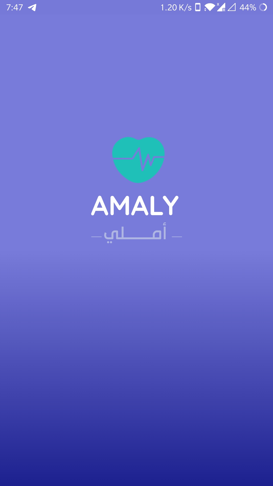
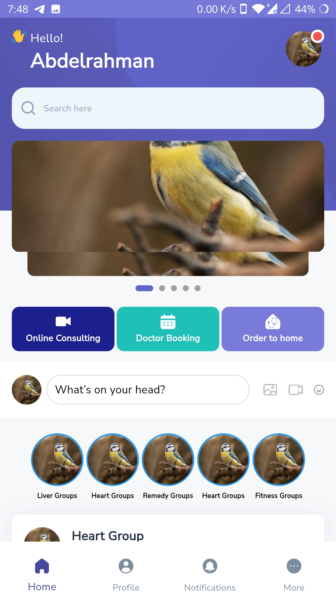
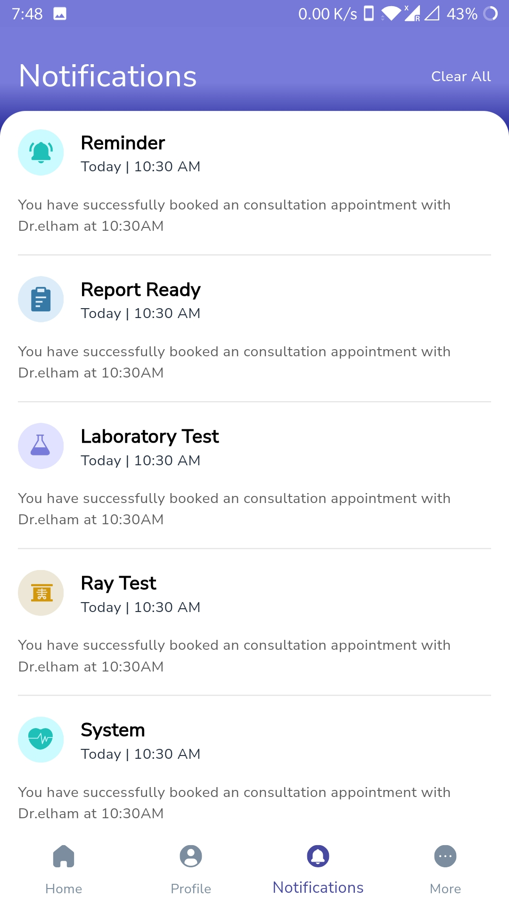
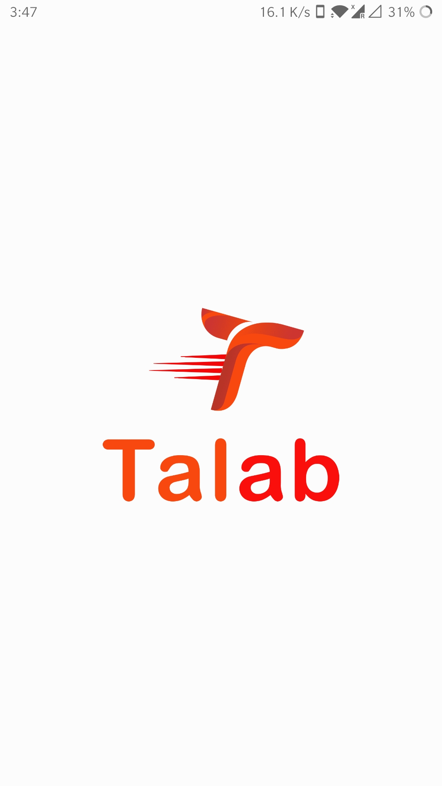
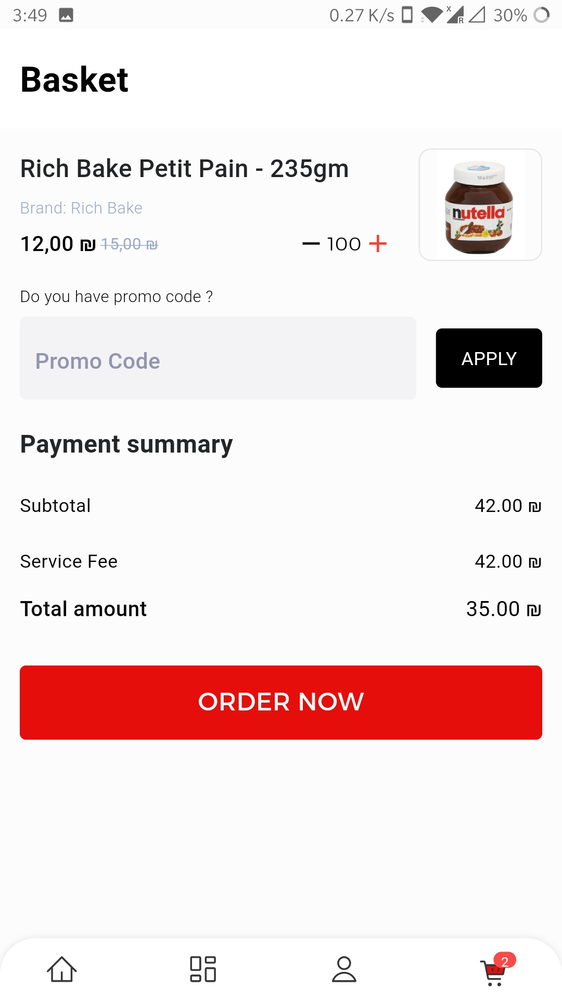
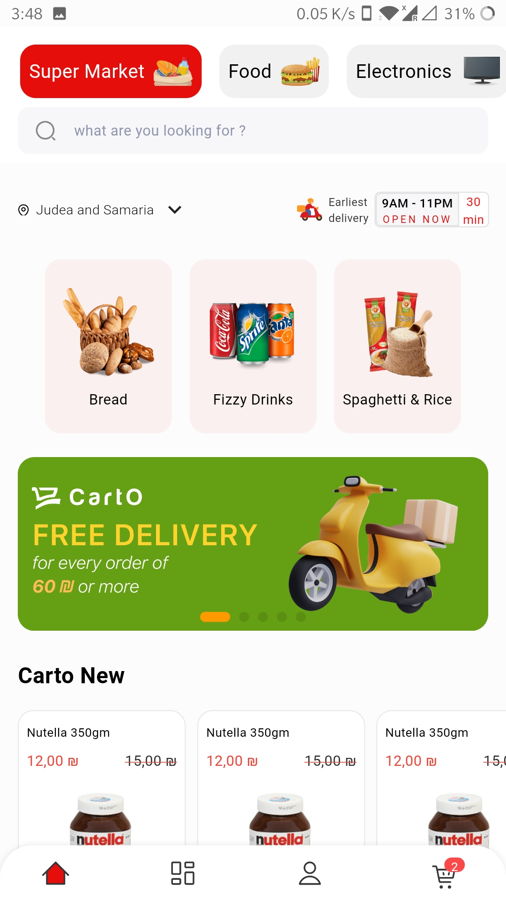

Self-motivated Developer adds high level of experience over more than 2 years collaborating and working on multiple flutter projects.
Passionate, hardworking coder with penchant for developing customized interfaces that factor in unique demands for accessibility, reachability and security.
Organized approach to meeting multiple, concurrent deadlines.
Pulls from active knowledge of current technology landscape to promote best practices in flutter.

## I have worked on the following projects :

- [Amaly](Pictures/Amaly)

<table>
  <tr>
    <td></td>
    <td></td>
    <td></td>
  </tr>
 </table>

- [Amaly Doctor](Pictures/Amaly%20Doctor)

<table>
  <tr>
    <td></td>
    <td></td>
    <td></td>
  </tr>
 </table>
 
- [Carto](Pictures/Carto)

<table>
  <tr>
    <td></td>
    <td></td>
    <td></td>
  </tr>
 </table>

- [Carto Delivery]
- [Dalelak](https://play.google.com/store/apps/details?id=com.dalilak.dalilak_app)
- [EarthCo.](https://earth-7b102.web.app/)
- [Food Express Egypt](https://play.google.com/store/apps/details?id=com.foodexpresseg.customer)
- [Himam User](Pictures/Himam%20user)

<table>
  <tr>
    <td></td>
    <td></td>
    <td></td>
  </tr>
 </table>

- [Himam Driver](https://play.google.com/store/apps/details?id=com.engaz.himam_driver)
- [Jibler Driver]
- [Jibler Partner]
- [Jibler User]
- [Magic Market](https://magicmarket4u.web.app/)
- [Modrsy](https://modrsy.com/)
- [MyPlanner](Pictures/My%20Planner)

<table>
  <tr>
    <td></td>
    <td></td>
    <td></td>
  </tr>
 </table>

- [Speedana Driver](https://play.google.com/store/apps/details?id=jibler.driver.jiblerdriver)
- [Speedana User](https://play.google.com/store/apps/details?id=com.engazTech.speedana)
- [Sumo](https://play.google.com/store/apps/details?id=co.tecfy.task_management)
- [Tecfy Attendance](https://play.google.com/store/apps/details?id=co.tecfy.emp)

<!---
AhmedHossien/AhmedHossien is a ✨ special ✨ repository because its `README.md` (this file) appears on your GitHub profile.
You can click the Preview link to take a look at your changes.
--->
